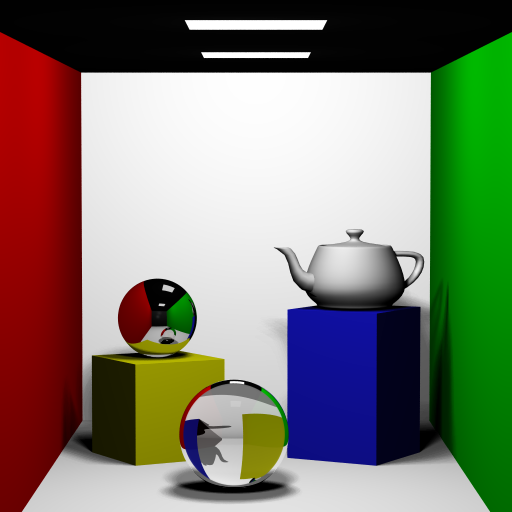
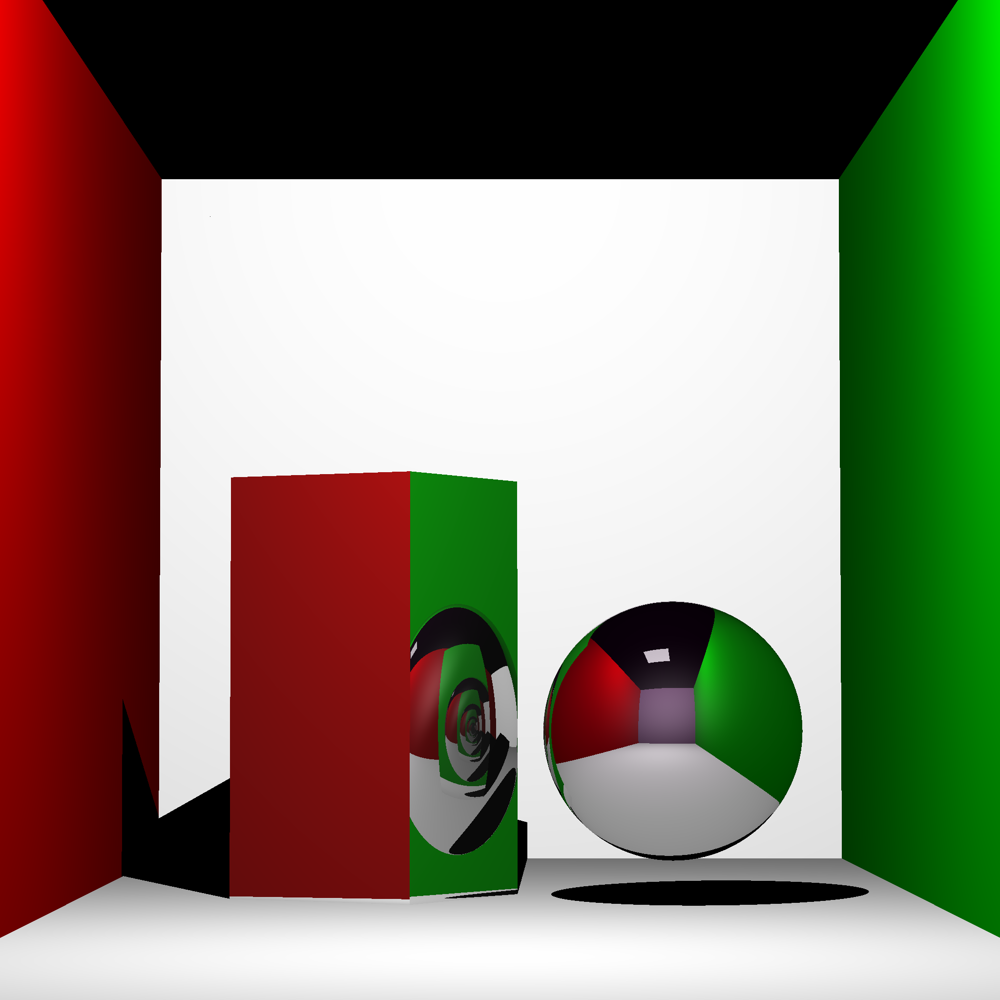
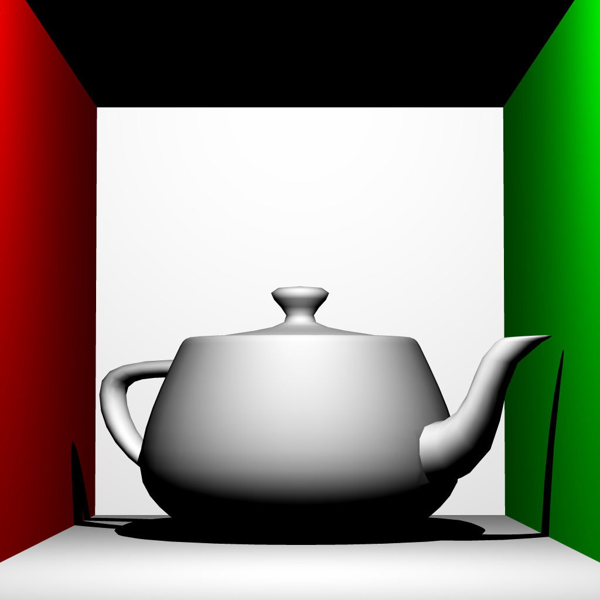

# raytracer

## Alexander Chan, Julia Chun, Ray Kim

## Overview

A distribution ray tracer supporting JSON scenes, Lambert and Blinn-Phong shading, acceleration structures, ambient occlusion, and stochastic features including soft shadows and glossy reflection.

## Renders

## Work Divsion

Alex worked on ray casting, Lambert and Blinn-Phong shading, the kd-tree, sampling, soft shadows, glossy reflections, reflection, refraction with Fresnel, meshes, multithreading, and progressive preview.

Julia worked on reading JSON scenes, normal mapping, and ambient occlusion.

Ray worked on all the primitives, including cubes, spheres, squares, cylinders, cones, **add more**, texture mapping, and depth of field.